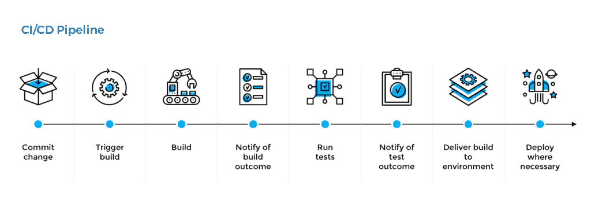

# Continuous Integration & Continuous Delivery (CI/CD)

## What is it?

**Continuous Integration (CI)** - a practice in which members of a team integrate their work frequently.

**Continuous Delivery (CD)** - a discipline where software is built in a manner that allows for **deploying** to customers at any time.

**Continuous Deployment (CD)** - this **extends Continuous Delivery** by automating the deployment process so that code is automatically deployed to production after it passes automated testing.

## Benefits

- More time for innovation
- Better retention rates
- More revenue
- Business efficiency

## CI/CD Fundamentals

- **A single source repository**   
  Source code management (SCM) that houses all necessary files and scripts to create builds.
- **Automated builds**   
  Scripts should include everything you need to build from a single command.
- **Builds should be self-testing**   
  Testing scripts should ensure that the failure of a test should result in a failed build.
- **Frequent iterations**   
  Multiple commits to the repository mean there are fewer places for conflicts to hide.
- **Stable testing environments**   
  Code should be tested in a cloned version of the production environment.
- **Maximum visibility**   
  Every developer should be able to access the latest executables and see any changes made to the repository.
- **Automated deployments**   
  Code should be able to deploy into multiple environments easily.

## What is the CI/CD Pipeline?

**CI/CD pipeline** - an automated sequence of events that is initiated after you update the code.

Takes care of the work (that you would otherwise need to perform manually):

- previewing a in-development site
- testing a new code
- deploying it to a production server

## CI/CD pipeline



## CI/CD tools

- Travis CI
- GitLab CI
- Jenkins
- ...

## Version management with SemVer

Formula: `MAJOR.MINOR.PATCH-LABEL`

Examples:
```
2.3.1
1.0.0-alpha
1.0.0-beta
```

`MAJOR` - version when you make incompatible API changes,
`MINOR` - version when you add functionality in a backwards compatible manner, and
`PATCH` - version when you make backwards compatible bug fixes.
`LABEL` - for pre-release and build metadata are available as extensions to the MAJOR.MINOR.PATCH format.

## Registries

- **Package registries**
- **Image registries**
