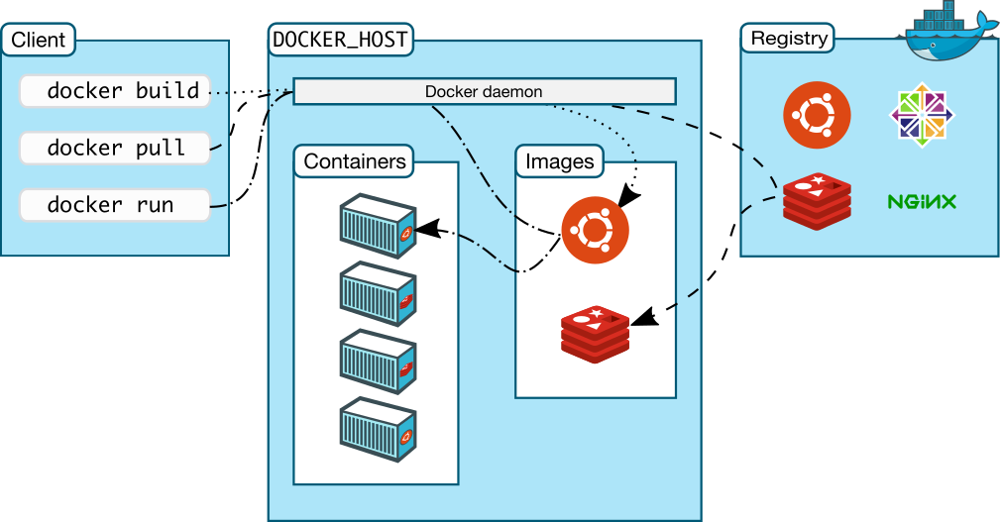

# Containers with Docker

Container - is a running process, with some added encapsulation features.

## Provides

  - developing lots of small changes
  - shipping easily
  - running everywhere
  
## Docker Architecture


### Docker Engine

- Server (daemon process)
- REST API
- Client (CLI)

### Docker objects

- Images
- Containers
- Networks
- Volumes
- ... some more objects

They all are available to be observed and controlled using the command `docker <object-name>`.

## Architecture



- client (CLI via REST API)
- server (Docker host) - deamon, containers, images, volumes
- registry - Docker Hub

## Development Scenario

1. Developers write code and share their work using Docker containers
2. Developers use Docker to push their applications into a **test environment** and execute automated and manual tests
3. Developers find bugs, they fix them in the **development environment** and redeploy to the **test environment**
4. When testing is complete, getting the fix to the customer is as simple as pushing the updated image to the **production environment**

## CLI commands

CLI uses Docker RESR API - https://docs.docker.com/develop/sdk/examples/

- `docker help`
- `docker ps` - list containers
- `docker container`
- `docker image`
- `docker volume`
- `docker networks`
- `docker system` - info
- `docker run` - run a command in a new container
- `docker exec` - run a command in a running container

Example: `docker run -i -t ubuntu /bin/bash`

## Building Docker images

`Dockerfile` - configuration file for building images.

**Python:**
```
FROM ubuntu:15.04
COPY . /app
RUN make /app
CMD python /app/app.py
```

**Node.js:**
```
FROM node:12
WORKDIR /usr/src/app
COPY package.json .
RUN npm install
COPY . .
CMD [ "npm", "start" ]
```

To exclude some files from the docker we use [`.dockerignore` file](https://docs.docker.com/engine/reference/builder/#dockerignore-file)

## Storage

Overview - https://docs.docker.com/storage/

Storage types:

  - volume - https://docs.docker.com/storage/volumes/
  - bind mount - https://docs.docker.com/storage/bind-mounts/
  - tmpfs mount - https://docs.docker.com/storage/tmpfs/

## Container orchestration
